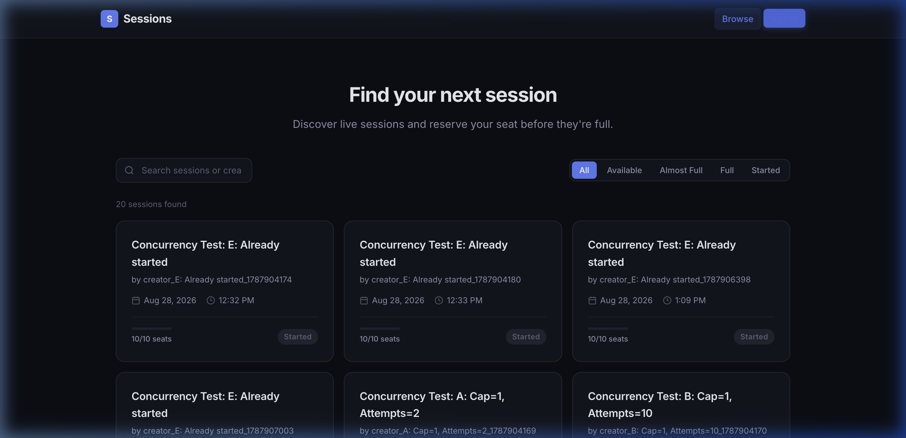
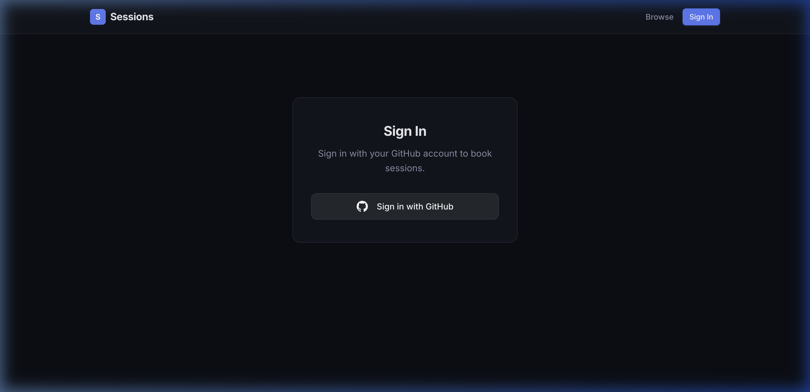
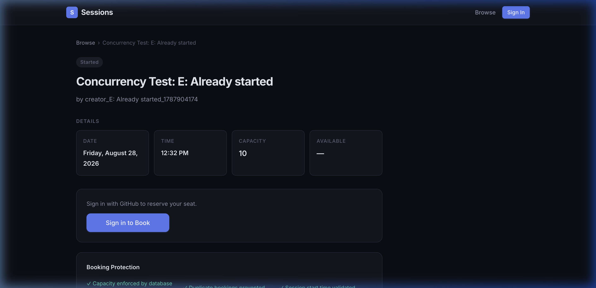
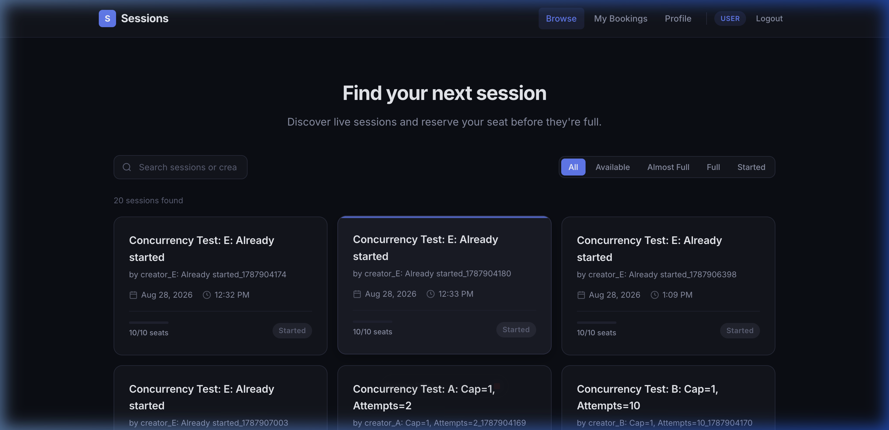
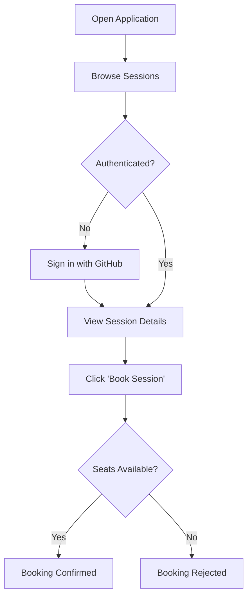
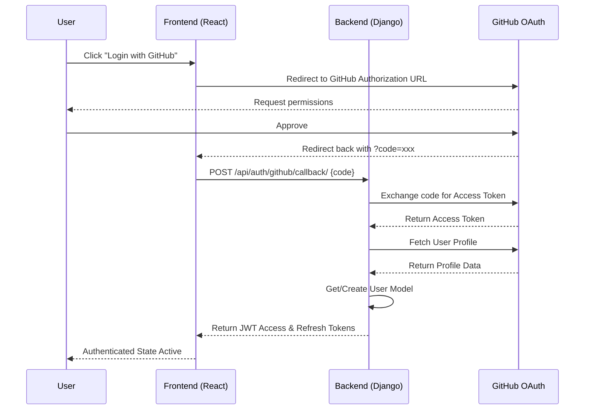
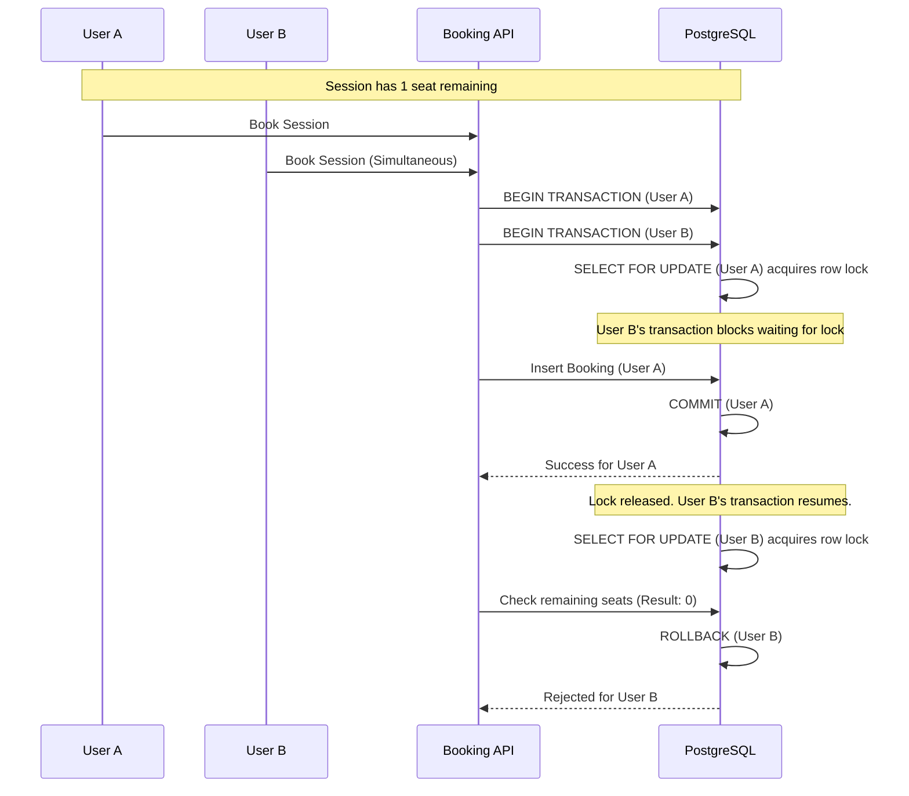
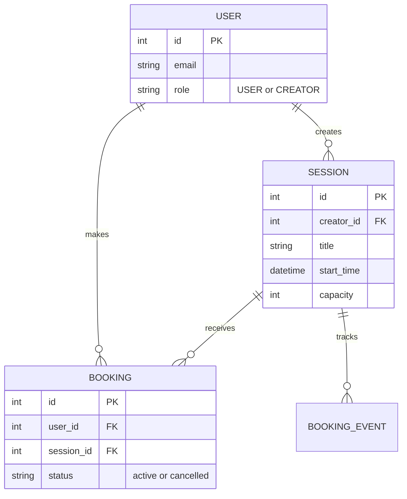

<div align="center">
  <h1>🚀 Ahoum Sessions Marketplace</h1>
  <p><em>A full-stack platform for discovering, managing, and booking knowledge-sharing sessions.</em></p>
  
  
  
  
  
  
  
</div>

---

**[Overview](#-1-project-overview) | [Features](#-2-key-features) | [Screenshots](#-3-application-screenshots) | [Architecture](#️-4-system-architecture) | [Flows](#-5-user-journey-flow) | [Auth](#-6-github-authentication-flow) | [Booking](#-7-booking--concurrency-flow) | [Data Model](#️-8-database-model) | [Tech Stack](#-9-tech-stack) | [Structure](#-10-project-structure) | [Setup](#-11-local-setup) | [Testing](#-13-testing--verification)**

---

## ⚡ 1. Project Overview
A compact sessions marketplace where users authenticate, browse sessions, and book them, while creators create and manage sessions. Built as a full-stack developer assignment.

**The Problem:** High-concurrency booking platforms often fail under pressure, allowing double-bookings if two users click "Book" simultaneously. 
**The Solution:** This platform enforces strict PostgreSQL row-level locks (`SELECT FOR UPDATE`) to guarantee capacity invariants regardless of network latency or concurrent requests.

## ✨ 2. Key Features

### Marketplace
- **Discoverability:** A modern, responsive catalog to browse available knowledge-sharing sessions.
- **Session Details:** View capacity, start times, and descriptions before booking.

### Authentication
- **GitHub OAuth:** Secure, passwordless login flow mapping GitHub identities to local users via JWT tokens.

### Sessions & Access
- **Role-Based Access Control:** Differentiates `USER` (can book) and `CREATOR` (can host sessions).
- **Session Management:** Creators can seamlessly create, edit, and delete their own sessions.

### Booking & Reliability
- **Transaction-Safe Booking:** Database-level concurrency safety prevents overbooking.
- **Idempotency Protection:** Prevents duplicate bookings from network retries or double clicks.
- **Booking Integrity Console:** A specialized dashboard visualizing active PostgreSQL row-level locks and transaction events in real time.

---

## 📸 3. Application Screenshots

<table>
  <tr>
    <td width="50%" valign="top">
      
      <p align="center"><b>Landing & Marketplace</b><br/><i>The responsive session catalog available to all users.</i></p>
    </td>
    <td width="50%" valign="top">
      
      <p align="center"><b>GitHub OAuth Login</b><br/><i>Seamless third-party authentication flow.</i></p>
    </td>
  </tr>
  <tr>
    <td width="50%" valign="top">
      
      <p align="center"><b>Session Details & Booking</b><br/><i>Detailed session view with capacity tracking and booking.</i></p>
    </td>
    <td width="50%" valign="top">
      
      <p align="center"><b>User Dashboard</b><br/><i>Personalized view showing active bookings.</i></p>
    </td>
  </tr>
</table>

---

## 🏗️ 4. System Architecture

```mermaid
graph TD
    Client[Web Browser] -->|HTTP/REST| Proxy[Nginx Proxy :80]
    
    subgraph Frontend
        Proxy -->|Serve Static| React[React + Vite SPA]
    end
    
    subgraph Backend API
        Proxy -->|Route /api/*| Django[Django REST Framework]
        Django -->|Authenticate| GitHub[GitHub OAuth API]
    end
    
    subgraph Database
        Django -->|Read/Write & Lock| DB[(PostgreSQL :5432)]
    end
```


- **Nginx:** Acts as a reverse proxy, cleanly routing `/api/*` requests to Django and all other requests to the React SPA.
- **React/Vite:** Provides a fast, client-side rendered user interface.
- **Django DRF:** Handles business logic, authentication, and database orchestration.
- **PostgreSQL:** Persists data and enforces critical row-level locks for transaction safety.

---

## 🗺️ 5. User Journey Flow



---

## 🔐 6. GitHub Authentication Flow



---

## 🛑 7. Booking & Concurrency Flow

The most critical engineering requirement is preventing overbooking when multiple users attempt to book the final seat simultaneously.



**Verification:** The repository includes a multi-threaded concurrency test (`scripts/concurrency_test.py`) that hammers the local database with simultaneous requests to mathematically prove this invariant holds.

---

## 🗄️ 8. Database Model



---

## 💻 9. Tech Stack

| Layer | Technology | Purpose |
|------|------------|---------|
| **Frontend** | React 18, Vite 5 | Fast, client-side rendering and UI state management. |
| **Styling** | Vanilla CSS | Clean, custom styling without heavy framework dependencies. |
| **Backend** | Django 4.2, DRF | Robust MVC framework for business logic and API routing. |
| **Database** | PostgreSQL 15 | Relational persistence and ACID-compliant transaction locking. |
| **Authentication** | GitHub OAuth, SimpleJWT | Secure, passwordless identity verification. |
| **Infrastructure** | Docker Compose | Reproducible local development environments. |
| **Deployment** | Vercel | Serverless hosting configuration included (`vercel.json`). |

---

## 📂 10. Project Structure

```text
ahoum-session-marketplace/
├── backend/               # Django API application
│   ├── accounts/          # User & Auth models
│   ├── bookings/          # Transactional booking logic
│   └── sessions_app/      # Session CRUD logic
├── frontend/              # React + Vite application
│   ├── src/components/    # Reusable UI elements
│   ├── src/pages/         # Route views
│   └── src/contexts/      # Auth & API state
├── docs/screenshots/      # README assets
├── scripts/               # Automated testing & verification scripts
├── docker-compose.yml     # Local infrastructure definition
└── vercel.json            # Vercel serverless deployment config
```

---

## 🚀 11. Local Setup

This project uses Docker Compose to guarantee a flawless setup experience on any machine.

**1. Clone the repository:**
```bash
git clone https://github.com/yourusername/ahoum-session-marketplace.git
cd ahoum-session-marketplace
```

**2. Configure Environment Variables:**
```bash
cp .env.example .env
```
*(Open `.env` and configure your GitHub OAuth Client ID and Secret if you want to test authentication. See the comments inside the file).*

**3. Build and Start the Application:**
```bash
docker compose up --build -d
```

**4. Access the App:**
- Open `http://localhost` in your browser.
- The React frontend runs on port 80 (via Nginx), and the API is accessible at `/api/`.

---

## 🔑 12. Environment Variables

| Variable | Used By | Purpose |
|----------|---------|---------|
| `VITE_GITHUB_CLIENT_ID` | Frontend (Public) | Tells GitHub which app is requesting authorization. |
| `VITE_API_BASE_URL` | Frontend (Public) | Maps API calls (e.g., `http://localhost/api`). |
| `GITHUB_CLIENT_SECRET` | Backend (Secret) | Used by Django to securely exchange the OAuth code for a token. |
| `DJANGO_SECRET_KEY` | Backend (Secret) | Cryptographic signing key for Django sessions and JWTs. |
| `DATABASE_URL` | Backend (Secret) | Connection string for PostgreSQL (Production only). |

---

## 🧪 13. Testing & Verification

The project includes strict automated tests to verify business logic and concurrency invariants.

**Run the Integration Test Suite:**
```bash
docker compose exec backend bash /app/scripts/verify.sh
```
*Verifies OAuth workflows, session creation, capacity limits, and expected error states.*

**Run the Concurrency Stress Test:**
```bash
docker compose exec backend python /app/scripts/concurrency_test.py
```
*Fires simultaneous multi-threaded booking requests at a single session to prove that `SELECT FOR UPDATE` successfully prevents overbooking.*

---

## 🌟 14. Engineering Highlights

- **Transaction-Safe Booking:** Real-world capacity guarantees using database-level locks, avoiding race conditions common in naive implementations.
- **Dockerized Development:** Zero-config local setup. `docker compose up` brings up Nginx, React, Django, and PostgreSQL perfectly networked.
- **Idempotency Protection:** Prevents duplicate bookings if a user double-clicks the "Book" button or experiences a network retry.
- **RESTful Architecture:** Clean separation of concerns between the React SPA and the stateless Django API.

---

## 🔮 15. Future Improvements

While this assignment covers the core requirements, a production release would benefit from:
- **Real-Time Websockets:** Pushing live capacity updates to the frontend so users see seats disappearing instantly.
- **Cancellation & Refunds:** Allowing users to cancel bookings and automatically freeing up capacity.
- **Email Notifications:** Sending confirmation emails and calendar invites upon successful booking.
- **Rate Limiting:** Protecting the public API endpoints from abuse.

---
<div align="center">
  <i>Developed for the Ahoum Full-Stack Developer Assessment.</i>
</div>
